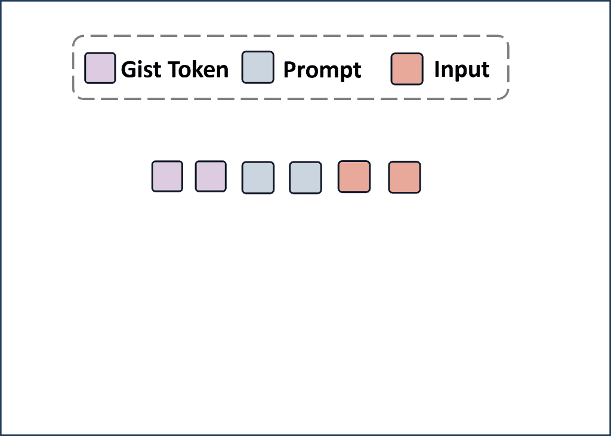

# Gist-COCO

Source code for our paper :  
***Say More with Less: Understanding Prompt Learning Behaviors through Gist Compression***

If you find this work useful, please cite our paper  and give us a shining star 🌟

## Overview
Gist-COCO is a novel method for compressing prompts. Gist-COCO employs an encoder-decoder based language model and then incorporates an additional encoder as a plugin module to compress prompts with inputs using gist tokens. It finetunes the compression plugin module and uses the representations of gist tokens to emulate the raw prompts in the vanilla language model. By verbalizing the representations of gist tokens into gist prompts, the compression ability of Gist-COCO can be generalized to different LLMs. 

**1. The inference process of Gist-COCO**
<p align="center">
  
</p>


**2. The generalisation of Gist-COCO**
<p align="center">
  
</p>


## Quick Start

**1. Clone from git**
```bash
git clone https://github.com/OpenMatch/Gist-COCO
cd Gist-COCO
```

**2. Data**
Our data consists of two parts, the first part is the training data used to train the Gist-COCO model: `train`, and the second part is the test data used for the two compression scenarios: `passage` and `instruction`. 
Once you have downloaded the data, you need to store them in the  `data` folder in the following format. All data is stored [here](https://drive.google.com/drive/folders/1Xu9vOPOtv5S3JLiPEB8MAfYsARVQXP5N?usp=sharing).

```
data/
├──train/
│   ├── train_data.json
│   ├── dev_data.json
├──passage/
│   ├── popqa_top10.jsonl
│   ├── nq_top10.jsonl
│   ├── triviaqa_top10.jsonl
│   ├── hotpotqa_top10.jsonl
└──instruction/
    ├── alpaca_plus_validation_seen.json
	├── alpaca_plus_validation_unseen.json
    └── alpaca_plus_validation_human.json
```

**3. Requirement**

 * Install the following packages using Pip or Conda under this environment.

```
Python==3.8.16
Pytorch
transformers==4.29.0
tqdm
numpy==1.23.5
torch==2.0.1
protobuf==3.20.3
jsonlines==3.1.0
nltk==3.8.1
evaluate==0.3.0
Install openmatch-thunlp from https://github.com/OpenMatch/OpenMatch
```

 * Download the following language models for subsequent training and inference.
```
Flant5-base/large
Llama-7b/13b
Llama2-7b-hf
```

## Train Gist-COCO
**1. Training**
We use the data in the data/train file to train Gist-COCO. These data are all collected from the  `Nvi2 ` data, and we use  `T5ance ` to retrieve relevant passages from  `MS MARCO ` for the passage compression task:

```
cd scripts
bash train.sh
```

**2. Get Best Checkpoint**
Based on the output log obtained from the training, the checkpoint with the smallest dev loss is selected for inference.

**3. Download Checkpoint**
You can download the trained checkpoint from  [here](https://huggingface.co/OpenMatch/Gist-COCO/upload/main).

## Evaluate Gist-COCO
**1. Different Prompt Compression**
We test the performance of Gist-COCO on different prompt compression tasks.
* Passage Compression:
 
```
cd scripts
bash test_passage.sh
```

* Instruction Compression:
```
cd scripts
bash test_instruction.sh
```

**2. Generalze to Different LLMs**
We test the generalisation ability of Gist-COCO on different LLMs.

* Get gist prompts for two different compression tasks:
```
cd scripts
bash get_passage_gist_prompt.sh
bash get_instruction_gist_prompt.sh
```

*  Use gist prompt instead of the original prompt to test the compression ability of Gist-COCO. We have detailed instructions in the script for different compression tasks and different LLMs:
```
cd scripts
bash generalize_test.sh
```

## Contact Us

If you have questions, suggestions, and bug reports, please send a email to us, we will try our best to help you. 

```bash
lxzlxz0716@gmail.com  
```